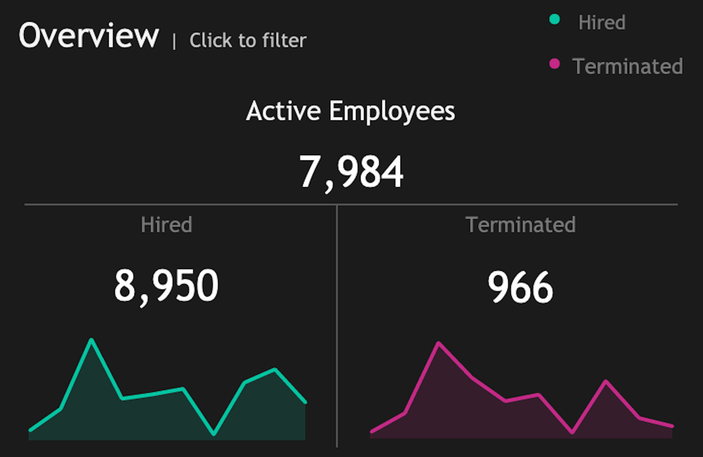
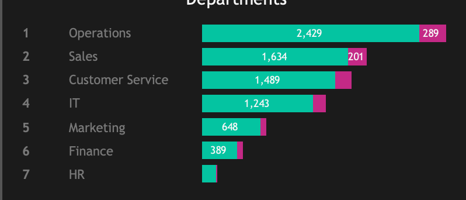
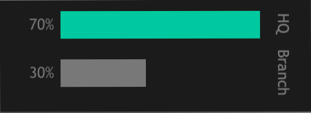
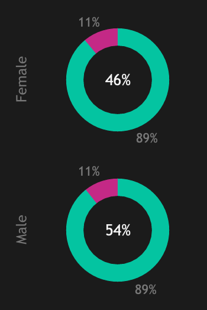
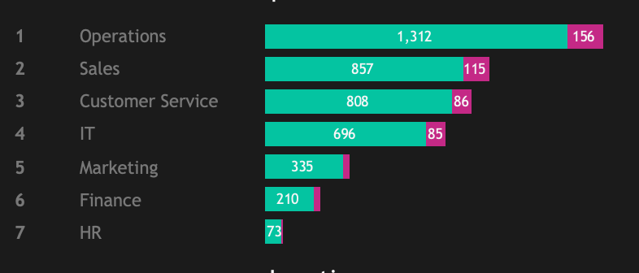
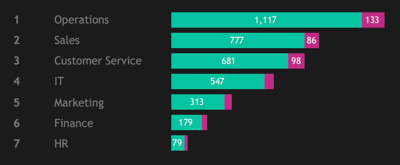
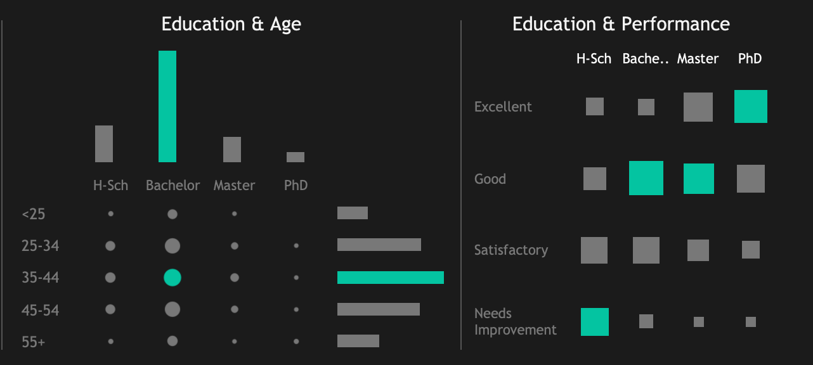

# Human Resources Data Dashboard

## Project Overview

Organizations continuously strive to enhance their workforce management strategies. With the rise of data-driven decision-making, HR analytics dashboards have become a critical tool for analyzing employee demographics, performance, and trends. This project focuses on creating an interactive dashboard that provides actionable insights into human resource data, enabling better workforce planning and management.

## Executive Summary

This project leverages dummy HR data (generated by ChatGPT) to analyze workforce trends, performance metrics, and salary distributions using **Tableau Desktop** app. Two dashboards have been developed accordingly:

1. **Overview Dashboard**: A high-level summary of employee statistics, including headcount, hiring and termination trends, department distribution, and demographics.
2. **Insights Dashboard**: A detailed exploration of salary trends, performance metrics, education levels, and other workforce analytics.

The aim is to derive actionable insights to enhance workforce management and decision-making.Some key findings include:

- **Department Trends**: Operations and Sales exhibit the highest employee turnover, while IT and Finance maintain higher retention.
- **Salary Insights**: IT roles show the highest median salaries, while Sales roles exhibit the largest gender pay gap.
- **Performance Analysis**: Employees with Master’s degrees tend to have higher performance ratings.
Demographics:
- **Gender Ratio**: 54% Male, 46% Female.
- **Education Levels**: Bachelor's degrees dominate at 60%, with consistent performance advantages.

## Insights Deep-Dive

### Overview

- **Active Employees**: 7,984 active employees with clear hiring and termination trends, including spikes in terminations during specific years.

- **Departmental Breakdown**: Operations has the largest headcount and the highest terminations, followed by Sales and Customer Service. Moreover, Operations and Sales exhibit the highest employee turnover, while IT and Finance maintain higher retention.

- **Regional Breakdown**: The state of New York has the largest number of active employees, with 70% of the workforce based at the headquarters in NYC.

### Demographics

- **Gender Ratio**: 54% male, 46% female, with slight male dominance across departments.

  

    
  

  

    
    
  

- **Age Distribution**: Majority of employees are in the 25-34 age range, indicating a younger workforce.
- **Education Levels**: Bachelor's degrees dominate at 60%, correlating with consistent performance advantages. Higher degrees (PhDs and Masters) demonstrate better performance levels, with PhDs rated "Excellent."

{width="500px"}

## Recommendations

- **Address Pay Gaps**: Initiate salary equity adjustments, particularly for women who have high-school or a bachelors degree as the highest education level as compared to women with the same highest level. On the other hand, women holding masters degree or a PHD earn higher than men at the same level, which also needs to be addressed. 
- **Retention Strategies**: Focus on mentoring and growth opportunities in high-turnover departments (e.g., Operations and Sales).
- **Upskilling Programs**: Develop targeted training for employees in the "Needs Improvement" category to improve productivity.
- **Hiring Optimizations**: Refine recruitment pipelines to target demographics (e.g., young graduates) with high potential for retention and performance.
- **Gender Discrepancies**: Address gender discrepancies to ensure women are adequately represented in the workforce.

## Clarifying Questions, Assumptions, and Caveats

**Questions**

The dataset contains comprehensive employee records, including details such as:

- Employee IDs
- Hiring dates
- Termination dates
- Department
- Location
- Gender

## Technologies Used

- **Tableau**: For building visualizations and interactive dashboards.

## Acknowledgement

This project is inspired by the techniques and ideas presented in the following online resource: [YouTube](https://www.youtube.com/watch?v=UcGF09Awm4Y&t=3613s).